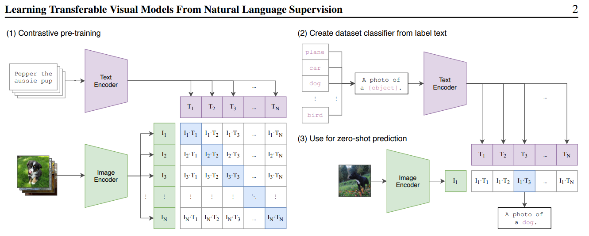
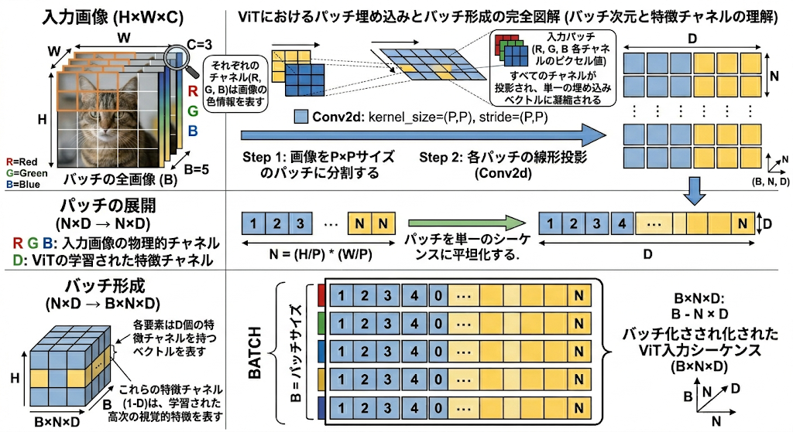
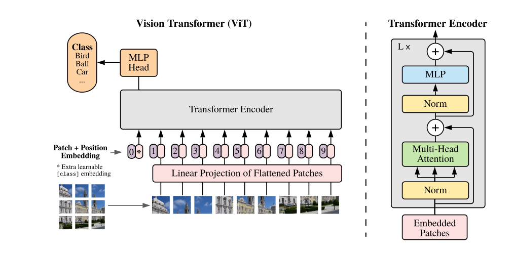
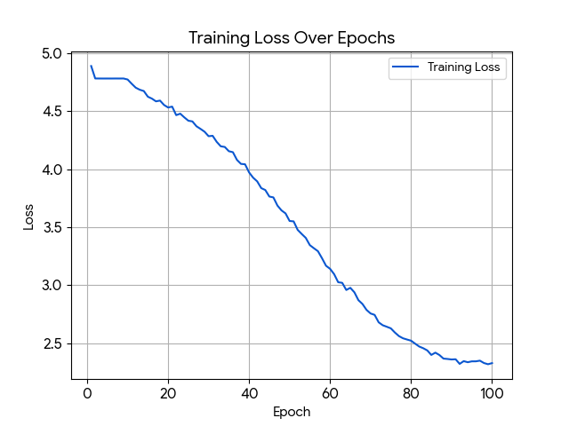

# Architecture of CLIP by PyTorch

OpenAIの[CLIP](https://openai.com/ja-JP/index/clip/)をPyTorchのみで実装しました。Transformersライブラリを使用せず、PyTorchのみでCLIPをスクラッチ実装した背景には、Transformerの挙動やViTの構造を深く理解したいという目的がありました。また、これまでの『書籍を参考にした実装』から脱却し、論文から直接実装に落とし込む経験を積むことも狙いとしています。

使用ライブラリ
* PyTorch
* einops
* math

## Project Structure
```text
Architecture-of-CLIP-by-PyTorch
 ┣ CLIP
 ┃ ┣ engine.py
 ┃ ┣ model.py
 ┃ ┗ __init__.py
 ┣ README.md
 ┗ mscoco.py
```
## Directory Structure Explained

* CLIP/
  1. model.py : CLIPのアーキテクチャ定義。Vision TransformerとText Transformerを定義
  2. engine.py : 学習・評価用エンジン。損失関数の計算や最適化ステップなどのトレーニングループを制御。
  3. __init__.py : CLIPをPythonモジュールとしてインポート可能にするための初期化ファイル。
* mscoco.py : mscocoによる学習。2017年のCocomsデータセットを用いています。 

## CLIPとは
CLIPとは、OpenAIが考案した、テキストから画像を分類することができるマルチモーダルモデルです(図はCLIPの原論文から引用)。




画像をViT(Vision Transformer)を使って、テキストをTransformerを使ってエンコードし、そのコサイン類似度を計算する手法を用いて分類を行っています。ラベルと正解画像のコサイン類似度が最大となるように学習を行います。このアーキテクチャの中でも重要な部分は、ViTです。ViTにより、画像にTransformerの手法を使い、アテンション計算を行うことが可能となりました。


画像のアテンション計算の方法を説明すると、画像を畳み込みを使ってバッチに分けたあと、1チャネルを1つの特徴量とみなしてアテンション計算を適用します。このとき、1つのチャネルにはバッチ数のピクセルがあり、それぞれのピクセルがそのバッチの特徴量となります。そして、チャネルの数が埋め込み次元の数、つまり特徴量の数となります。次の画像はそのプロセスをGeminiに可視化してもらった図です（インターネットには分かりやすい画像がなかったため）。




損失はコサイン類似度を計算することによって計算しますが、コサイン類似度を計算するということは内積をとるということであり、そのためにはTransformerで埋め込んだバッチサイズ×シーケンス長×埋め込み次元の形状のテンソルから、バッチ数×埋め込み次元（画像一つにつき、1×埋め込み次元というベクトルがバッチサイズの数だけある）という行列を抽出しなければいけません。これを実現するため、ViTの原論文では画像のチャネルに1つランダムなテンソルを一番最初のテンソルに、そしてテキストにはEOSテンソルというランダムなテンソルを最後のチャネルにくっつけ、トランスフォーマーエンコーダを抜けたあとにくっつけたテンソルのみ抽出してそれらでコサイン類似度を計算するという手法を取っています(図はViTの原論文から引用)。




ViTは画像の位置情報（ピクセル間の距離感など）を自明として学習し始めるCNNとは違い、ピクセル間の位置関係も0から学習させなければいけないため、CNNに比べ、精度を出すのにはるかに膨大な量の画像を学習させなければいけません。論文においては、3億枚の画像を学習させてはじめてResNetなどの既存のモデルを上回る精度を出せたということです。

## 学習について

mscoco.pyで行っている学習については、4億枚学習させたOpenAIとは違い、1000枚で学習させているため、挙動の確認の意味が強いです。損失の減少に関しても、100エポック回しても1エポック目の半分程度にしか損失が減少していません。これは、ViTはピクセル間の位置関係も0から学習させなければいけないため、当然の結果と言えます。損失の減少の様子は下のグラフから確認できます（今回はengine.pyの訓練ループの関数に損失をリスト化するコードを書かなかったため、Geminiを使って後から可視化させています）。



### 参考文献

* **Paper**

  * **CLIP**: [*Learning Transferable Visual Models From Natural Language Supervision* (Radford et al., 2021)](https://arxiv.org/abs/2103.00020) (Radford et al., 2021)

    * CLIPのアーキテクチャ、損失の計算のNumPyでの疑似コードを参考にしました。

  * **ViT(Vision Transformer)**: [*An Image is Worth 16x16 Words: Transformers for Image Recognition at Scale* (Dosovitskiy et al., 2020)](https://arxiv.org/abs/2010.11929)
 
    * ViTの詳細なアーキテクチャを参考にViTの実装を行いました。

  * **Transformer / GPT**
 
    * [*Language Models are Unsupervised Multitask Learners* (Radford et al., 2019)](https://cdn.openai.com/better-language-models/language_models_are_unsupervised_multitask_learners.pdf)
     
    * [*Improving Language Understanding by Generative Pre-Training* (Radford et al., 2018)](https://cdn.openai.com/research-covers/language-unsupervised/language_understanding_paper.pdf)
     
    * [*Attention Is All You Need* (Ashish et al.. 2017)](https://arxiv.org/abs/1706.03762)

      * テキストエンコーダの参考にしました。 
     
* **Books**

  * Lewis Tunstall, Leandro von Werra and Thomas Wolf, 『機械学習エンジニアのためのTransformers』, 中山光樹訳, オライリー･ジャパン, 2023

    * テキストエンコーダのコードは3章「Transformerの詳細」を参考にしました。

  * David Foster, 『生成Deep Learning』, 松田晃一, 小沼千絵訳, オライリー･ジャパン, 2024

    * CLIPの大まかなアーキテクチャを13章「マルチモーダルモデル」を参考にしました。
